#### リンク

[【 Minecraft 】ホロ鯖夏祭り2023の前日だああ！！最後の調整！【常闇トワ/ホロライブ】](https://www.youtube.com/watch?v=vejtQCr8Smo)

[【 Minecraft 】#ホロ鯖夏祭り2023　ホロコロシアム開催！花火も見る！【常闇トワ/ホロライブ】](https://www.youtube.com/watch?v=bmpQJICRNCE)

#### 感想

#ホロ鯖夏祭り2023 お疲れ様でした～  
今年も皆さんがたくさんの素敵な建築を作りましたね！  
影MODを使うことで、会場全体の雰囲気が完璧だった！今年の景色は去年よりも更に素晴らしいと思います！  
花火めっちゃきれいです！  
ホロコロシアムの対戦も本当に面白かった！地形やランダムな要素が加わって、最後まで誰が勝者か予測できませんでした。

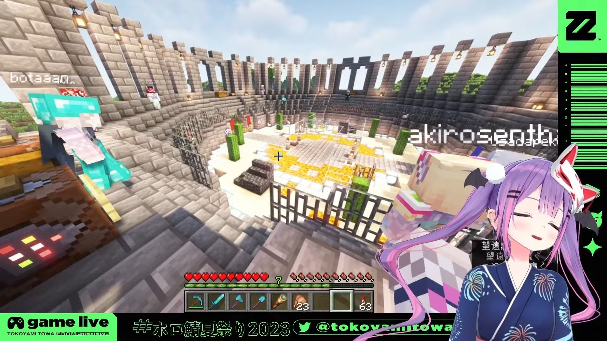  
ホロコロシアム

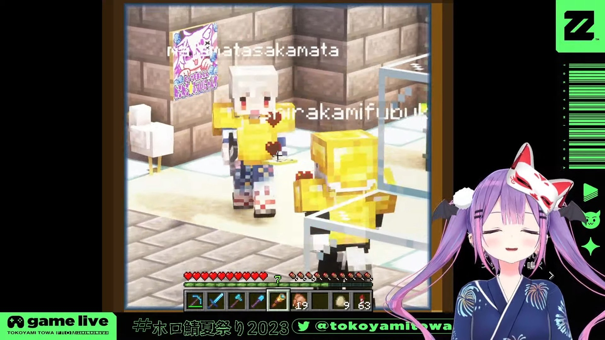  
卵は本当に邪魔だった！🤣  
望遠鏡は本当に良いアイデアでした！

競馬場の今年のコースは去年よりも更に難しかったね！客席もめっちゃオシャレ！いろんなネタも面白かった！

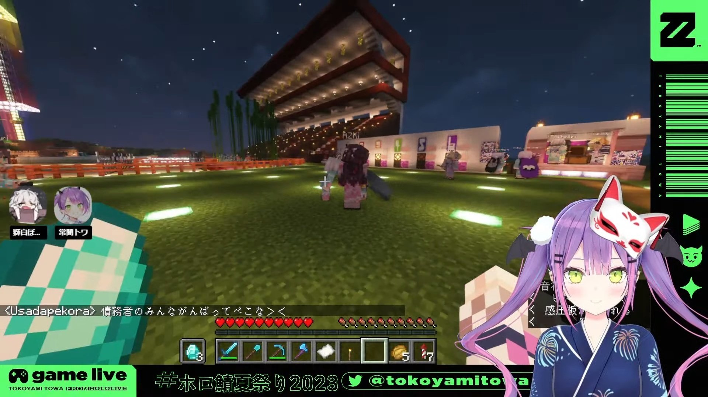  
競馬場

お化け屋敷も今年は怖い要素が増えて、本当に驚きました！

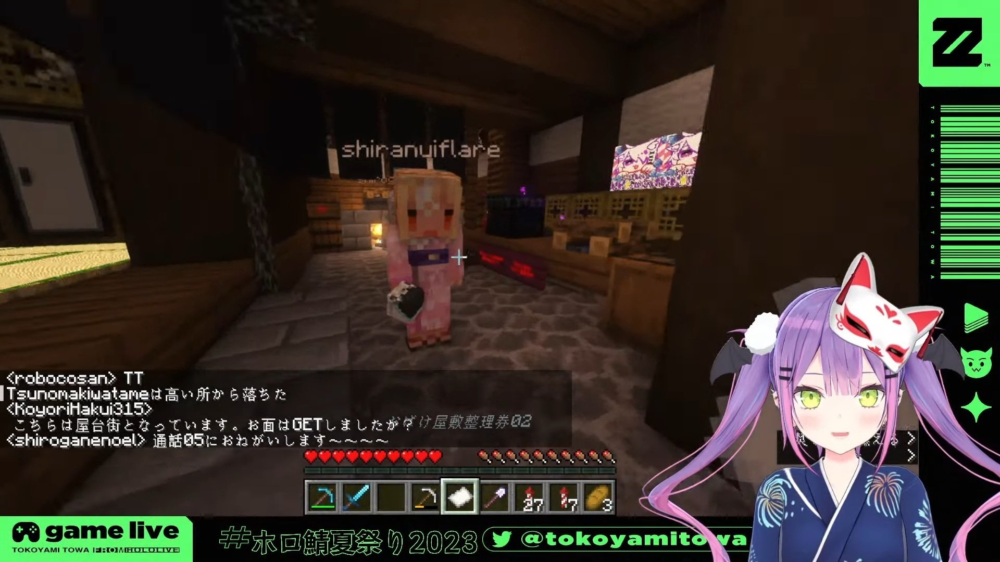  
お化け屋敷

いろんな販売機は本当に素晴らしいアイデア！自動化は最高です！

他にもたくさんの素晴らしい施設がありました！遊びの要素がある施設であれ、観賞性の要素がある施設であれ、皆さんのアイデアは本当に素晴らしい！去年参加できなかった人たちも、今年は参加するチャンスがあります。

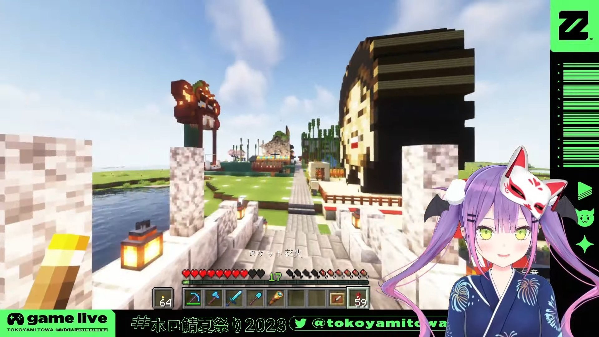  
遊びの要素がある施設 1 

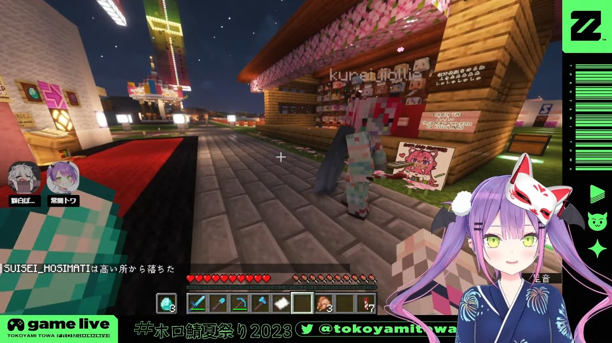  
遊びの要素がある施設 2

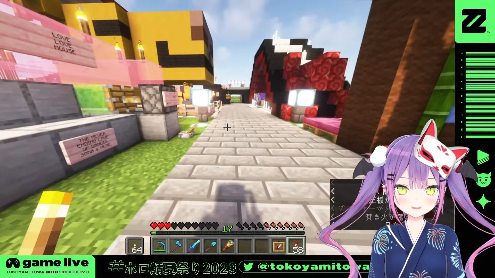  
観賞性の要素がある施設 1 

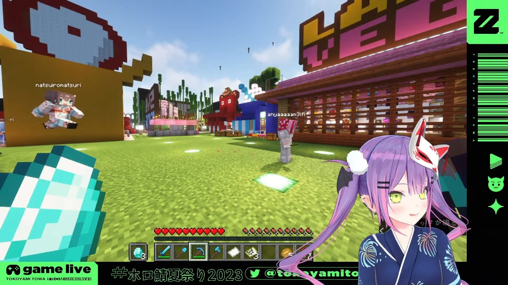  
観賞性の要素がある施設 2

新しい施設を設計するものから、以前に作った施設を最適化するものまで、皆さんのマイクラの知識は明らかに向上しているようです。建設グループでの作業でも、一人での作業でも、皆で助け合い、建設過程で他の人たちの作品を見るのも本当に楽しいです。

今年もいっぱい面白いアイデアを具現化し、機械を使って労力を減らして、本当に素晴らしい！施設の作成者であっても、祭りを楽しむための時間とエネルギーが増えました。  
今年の祭りで、多くのメンバー間のやり取りのかわいいシーンを見たことも、本当に嬉しい。

2021年から2023年まで、場所を三回変え、更に多くの自動施設を追加して、プロセスがスムーズになり、皆が祭りを更に楽しめましたね。

本当に素晴らしい事です。

  

トワ様がコロシアムを作る時の配信の雰囲気が本当に好きでした。今年のトワ様は更に可愛くなったと思います。  
また、他のメンバーからの協力もあり、この機会に他のメンバーをより深く理解できました。多くの友達がいると本当に良いね！

準備期間中、ホロメンの皆忙しいと聞いたり、他の活動も準備していたので、2023年にもホロ鯖夏祭りを見ることができて、本当に感謝しています。

今年も様々なコンビでの瞬間を見ました！皆が浴衣を着て夏祭りを楽しむ姿は本当に可愛かった！

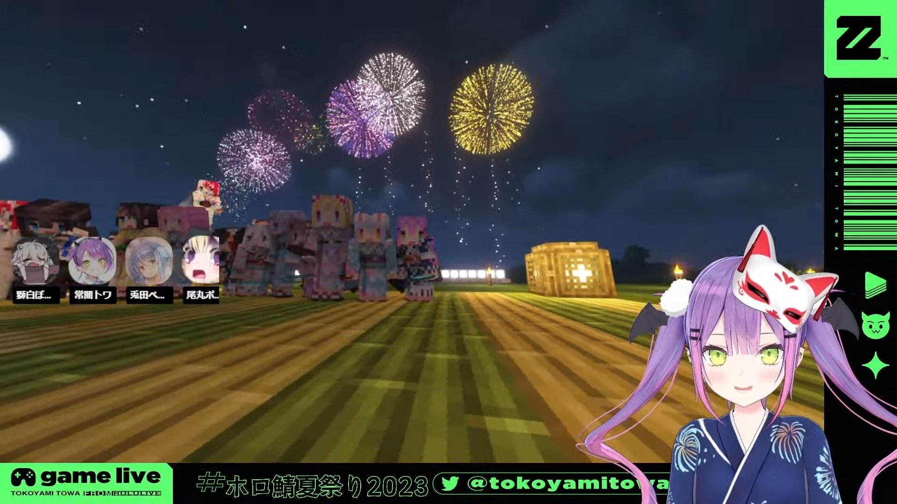  
花火会場（みんなで写真）

たくさんの楽しい時間をありがとうございました！  
最高でした！

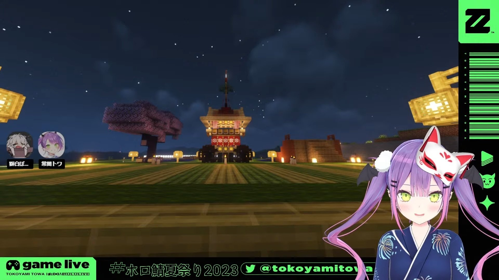  
花火会場（花火前）

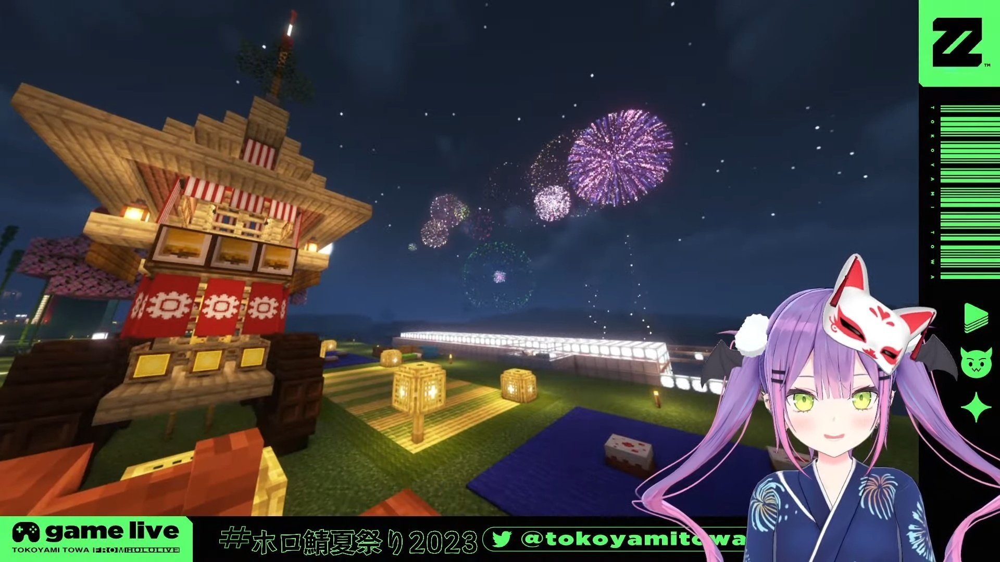  
花火会場（ソロ）
