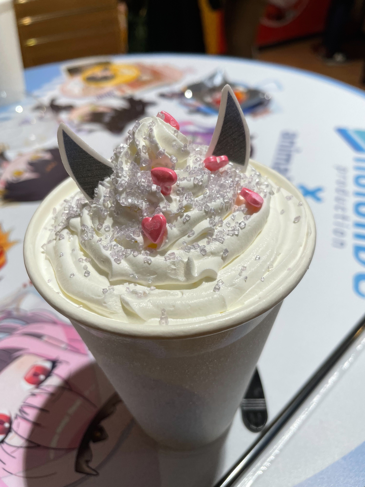
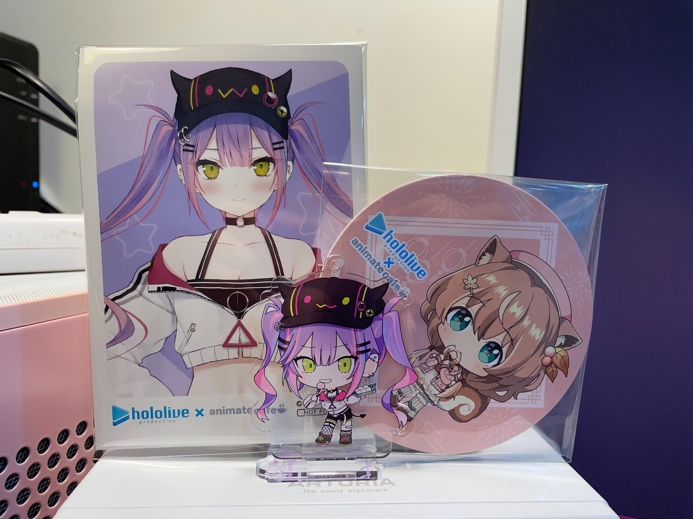
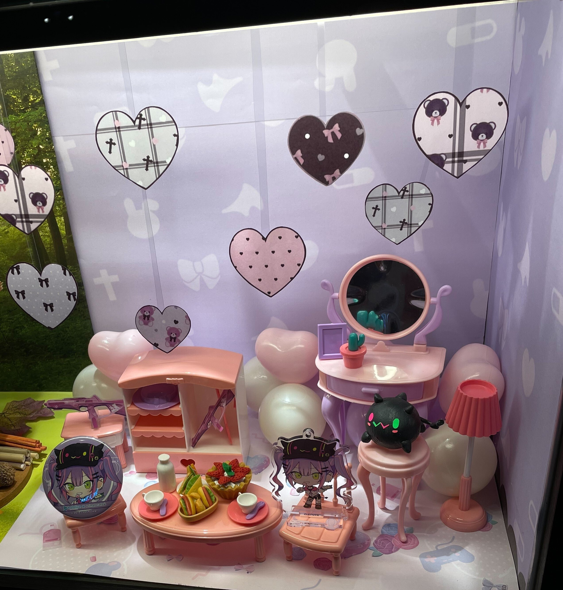

#### リンク

[https://www.moelong.com/moelongnews/archives/16414](https://www.moelong.com/moelongnews/archives/16414)

[https://www.facebook.com/animatecafetw/](https://www.facebook.com/animatecafetw/)

#### 感想

真的很謝謝願意和我交換的人，我也很開心東西都能找到屬於自己的主人。  
飲料真的很可愛！！

  
常闇トワ的可爾必思蘇打

這是我第一次參與這類活動，但我有個很棒的經驗！  
我想我認識了一個HOLOSTAR推的人、一個箱推的人和一個主推是すいせいさん的人。在要離開的時候，我們互相說了謝謝跟Bye bye～

  
送的杯墊、特典寫真卡和立牌都是和別人換過的。最後我們都能換到自己的主推我很開心！

我覺得這次我做最不好的事情，就是只要朋友沒有在我身邊，我就會忘記幫食物拍照。  
幸好箱推的那個人提醒我トワ様的飲料很可愛，我才想起來要幫可愛的東西拍一張照片！

店外櫥窗的特色布景也都很可愛！

  
我很喜歡那兩把銃，我在那邊盯著他們很久www。應該是301吧？

有興趣的人，相關的資訊連結如下：
